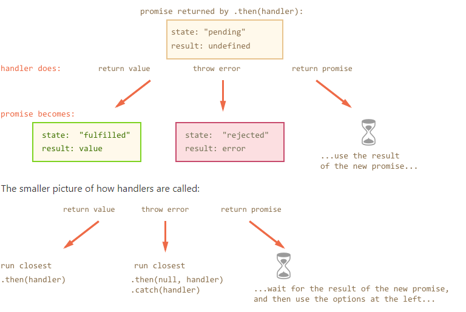

# A collection of resources for front end developers.

# Table Of Content

<ul>
  <li>
    <a href="#event-loop">Concurrency model and Event Loop</a>
  </li>
  <li>
    <a href="#js-versions">JavaScript/ECMAScript Versions</a>
  </li>
  <li>
    <a href="#strict">What does 'use strict' do?</a>
  </li>
  <li>
    <a href="#this">The keyword this in JavaScript</a>
    <ul>
      <li><a href="#global">Global</li>
      <li><a href="#methods">Methods</li>
      <li><a href="#explicit-bind">Binding explicitly</a></li>
      <li><a href="#new-instance">New instances</a></li>
      <li><a href="#dom-event-listeners">DOM Event Listeners</a></li>
    </ul>
  </li>
  <li>
    <a href="#hoisting">Variable Hoisting</a>
  </li>
  <li>
    <a href="#clojure">What is a Clojure</a>
  </li>
  <li>
    <a href="#js-most-important">Most important thing about functions in JavaScript ! (advanced topic)</a>
  </li>
  <li>
    <a href="#promises">Promises</a>
    <ul>
      <li><a href="#then-catch">Consumers: then and catch</a></li>
      <li><a href="#promise-chain">Promises chaining</a></li>
      <li><a href="#returning-promises">Returning promises</a></li>
      <li><a href="#async-await">Async/await</a></li>
      <li><a href="#multiple-promises">Multiple Async Promises</a></li>
      <li><a href="#mixed-execution">Mixed Execution Example</a></li>
    </ul>
  </li>
  <li>
    <a href="#modules">JavaScript Modules</a>
    <ul>
      <li><a href="#revealing-module-pattern">The Revealing Module Pattern</li>
      <li><a href="#commonJS">CommonJS</a></li>
      <li><a href="#amd">Asynchronous Module Definition (AMD)</a></li>
      <li><a href='#es2015'>ES2015 Modules</a></li>
      <li><a href="#umd">Universal Module Definition (UMD)</a></li>
      <li><a href="#system.js">The All-in-One Solution: System JS</a></li>
    </ul>
  </li>
  <li>
    <a href="#babel">
      What is Babel?
    </a>
  </li>
  <li>
    <a href="https://github.com/MartinNikolovMarinov/WebpackExamples/tree/master/06.app-example-with-typescript">
      Linting Setup and Rules for TypeScript and React
    </a>
  </li>
  <li>
    <a href="#what-is-webpack">What is Webpack?</a>
    <ul>
      <li><a href="#entry">Entry</a></li>
      <li><a href="#output">Output</a></li>
      <li><a href="#loaders">Loaders</a></li>
      <li><a href="#plugins">Plugins</a></li>
      <li><a href="#mode">Mode</a></li>
      <li><a href="#module">Module</a></li>
      <li><a href="#manifest">Manifest</a></li>
      <li><a href="#targets">Targets</a></li>
      <li><a href="#hot-module-replacement">Hot Module Replacement</a></li>
      <li>
        <a href="https://github.com/MartinNikolovMarinov/WebpackExamples" target="_blank">My Webpack Examples</a>
      </li>
      <li>
        <a href="https://github.com/webpack/webpack/tree/master/examples" target="_blank">Third Party Examples</a>
      </li>
      <li>
        <a href="https://webpack.js.org/configuration" target="_blank">Webpack Full Configuration File</a>
      </li>
      <li>
        <a href="https://webpack.js.org/loaders" target="_blank">Webpack Official Loaders List</a>
      </li>
    </ul>
  </li>
  <li>
    <a href="#workers"> Web Workers, Service Workers </a>
  </li>
  <li>
    <a href="#load-performance"> Web applications load performance </a>
  </li>
  <li>
    <a href="#react">React</a>
    <ul>
      <li>
        <a href="https://reactjs.org/docs/getting-started.html"> The React documentation for the basic concepts </a>
      </li>
      <li>
        <a href="#react-code-split"> Code Splitting </a>
      </li>
    </ul>
  </li>
  <li>
    <a href="#state">State Management</a>
    <ul>
      <li><a href="#mobx">Mobx State Management</a></li>
    </ul>
  </li>
  <li>
    <a href="#testing">Testing</a>
  </li>
  <li>
    <a href="#sources">Sources</a>
  </li>
</ul>

<h1 id="event-loop">Concurrency model and Event Loop</h1>

Javascript has a single threaded runtime, which means it can do one thing at a time. **One thread, one call stack, one thing at a time**. Which is why JavaScript has a concurrency model based on an **Event Loop**, for code that requires multi-threaded execution. This model is quite different from models in other languages.

Modern JavaScript engines implement and heavily optimize the described semantics :


The call stack is a **LIFO** queue (Last In, First Out), where functions create their local scopes and execute code. Any time a function is called it pushes a stack frame on top of the stack. This works for synchronous code, but some times we want to do work that is more time consuming, which will **block** the main thread.

Any JavaScript code that takes too long to return back control to the **Event Loop** will **block** the execution of other JavaScript code in the page, even block the UI thread, so the user can't click around, scroll the page, and so on.

Whenever one of the Web, or Node asynchronous apis are called, the execution gets differed to that api and when the work is done, a message gets added to the **Event Queue**.

Those messages have pre defined callback functions, which also have to execute and create stack frames. The Runtime waits until there is nothing in the Stack and then starts popping off of the **Event Queue** and on top of the Stack.

**Put simply - callbacks start getting executed after all synchronous code has finished work.**

`setTimeout` won't take precisely x milliseconds, but rather at least x milliseconds, because the **Event Queue** might be clogged. This is why we shouldn't have very heavy computational code in callbacks, they get executed on the main thread and can **block** it.

## ES6 Job Queue

ECMAScript 2015 introduced the concept of the **Job Queue**, which is used by Promises (also introduced in ES6/ES2015). It's a way to execute the result of an async function as soon as possible, rather than being put at the end of the **Event Queue**.

**Promises that resolve before the current function ends will be executed right after the current function.**

<h1 id="js-versions">
  JavaScript/ECMAScript Versions
</h1>

| Version                    | Description                                                                                 |
|----------------------------|---------------------------------------------------------------------------------------------|
| ECMAScript 1 (1997)        | First Edition                                                                               |
| ECMAScript 2 (1998)        | Editorial changes only                                                                      |
| ECMAScript 3 (1999)        | Added Regular Expressions and try/catch.                                                    |
| ECMAScript 4               | Never Released                                                                              |
| ECMAScript 5 (2009) aka es5| [List of new features](https://www.w3schools.com/Js/js_es5.asp)                             |
| ECMAScript 5.1 (2011)      | Editorial changes                                                                           |
| ECMAScript 2015 aka es6    | [List of new features](https://www.w3schools.com/Js/js_es6.asp)                             |
| ECMAScript 2016            | Added exponential operator (**), Array.prototype.includes                                   |
| ECMAScript 2017            | Added string padding, new Object properties, Async functions, Shared Memory                 |
| ECMAScript 2018            | Added rest/spread properties, Asynchronous iteration, Promise.finally(), Additions to RegExp|

<h1 id="strict">What does 'use strict' do?</h1>

Strict Mode is a feature in ECMAScript 5 that allows you to place a program, or a function, in a "strict" operating context. Strict mode helps out in a couple ways :
* It catches some common coding bloopers, throwing exceptions.
* It prevents, or throws errors, when relatively "unsafe" actions are taken (such as gaining access to the global object).
* It disables features that are confusing or poorly thought out.

## How do you enable strict mode?
```js
// First way is to use it globally.
'use strict';

function imStrict() {
  // Second way is to use it per function.
  'use strict';
}

(function() {
  // Defining it strictly for a module :
  'use strict';
})();
```

## Variables and Properties

An attempt to assign `foo = 'bar';` where `foo` hasn't been defined will fail. Previously it would assign the value to the foo property of the global object (e.g.  window.foo), now it just throws an exception. Also, deleting a variable, a function, or an argument will result in an error.

Examples :
```js
foo = 'test'; // Error, foo is not defined.
var foo = 'test';
function test(){}

delete foo; // Error, can't delete variables outside of objects.
delete test; // Error, can't delete functions outside of objects.

function test2(arg) {
  delete arg; // Error, can't delete function arguments.
}

{ foo: true, foo: false } // Error, duplicate object keys.
```

## eval

Virtually any attempt to use the name `eval` is prohibited - as is the ability to assign the `eval` function to a variable or a property of an object.

```js
// All generate errors...
obj.eval = 'test'
obj.foo = eval
var eval = 'test'
for ( var eval in ... ) {}
function eval(){}
function test(eval){}
function(eval){}
new Function('eval')

// Additionally, attempts to introduce new variables through an eval will be blocked.
eval('var a = false;');
console.log(typeof a); // undefined
```

## Functions

Attempting to overwrite the arguments object will result in an error:
```js
  arguments = []; // not allowed
```
Defining identically-named arguments will result in an error:
```js
function( foo, foo ) {}
```

Access to `arguments.caller` and `arguments.callee` now throw an exception. Thus any anonymous functions that you want to reference will need to be named, like so :
```js
setTimeout(function later() {
  // do stuff...
  setTimeout( later, 1000 );
}, 1000 );
```

The `arguments` and `caller` properties of other functions no longer exist - and the ability to define them is prohibited :
```js
function test(){
  function inner(){
    // Don't exist, either
    test.arguments = ...; // Error
    inner.caller = ...; // Error
  }
}
```

Finally, a long-standing (and very annoying) bug has been resolved. Cases where null or undefined is coerced into becoming the global object. Strict mode now prevents this from happening and throws an exception instead :
```js
(function(){ ... }).call( null ); // Exception
```

## with(){}

`with(){} `statements are dead when strict mode is enabled - in fact it even appears as a syntax error.


<h1 id="this"> The keyword this in JavaScript </h1>

<h2 id="global"> Global </h2>

By default **this** refers to the global object. That could be either window, if the code is running in the **Browser**, or it could be **global** if the code is running in **NodeJS**. If **use strict** is used then **this**, used outside of an object, will always refer to **undefined**.

The following code is written it the global context, ie. no modules, no IIFE, no object/classes, etc. Just plain procedural code :
```js
function fn() {
  const context = this;
  console.log(context === window); // true
}

function strictFn() {
  'use strict'
  const context = this;
  console.log(context === window); // false
}

fn();
strictFn();
console.log(this === window) // true
```

<h2 id="methods"> Methods </h2>

A method is a function attached to an object.

```js
const car = {
  maker: 'Ford',
  model: 'Fiesta',
  info() {
    console.log(`${this.maker} ${this.model}`)
  }
}

car.info2 = function() {
  console.log(`${this.maker} ${this.model}`)
}

/*
  When using arrow funcitons, the scope is inherited from the parent.
  In this case the window, so this.maker is undefined.
*/
car.info3 = () => {
  'use strict' // using strict doesn't prevent this === window !!
  console.log(`${this.maker} ${this.model}`)
}

car.info(); // Ford Fiesta
car.info2(); // Ford Fiesta
car.info3(); // undefined undefined
```

<h2 id="explicit-bind"> Binding explicitly </h2>

JavaScript offers a few ways to map **this** to any object you want.

#### Using **bind()**, at the function declaration step :
```js
const car = {
  maker: 'Ford',
  model: 'Fiesta'
}

const drive = function() {
  console.log(`${this.maker} ${this.model}`)
}

drive.bind(car);
drive() // Ford Fiesta
```

#### You could also bind an existing object method to remap its this value (Which is a BAD idea in general, but a good example) :
```js
const car = {
  maker: 'Ford',
  model: 'Fiesta',

  drive() {
    console.log(`${this.maker} ${this.model}`)
  }
}

const anotherCar = {
  maker: 'Audi',
  model: 'A4'
}

car.drive.bind(anotherCar)
car.drive() // Audi A4
```

#### Using **call()** or **apply()**, at the function invocation step :
```js
const car = {
  maker: 'Ford',
  model: 'Fiesta'
}

const drive = function(kmh) {
  console.log(`Driving a ${this.maker} ${this.model} car at ${kmh} km/h!`)
}

drive.call(car, 100) // Driving a Ford Fiesta car at 100 km/h!

drive.apply(car, [100]) // Driving a Ford Fiesta car at 100 km/h!
```

The first parameter you pass to **call()** or **apply()** is always bound to **this**. The difference between **call()** and **apply()** is just that the second one wants an array as the arguments list, while the first accepts a variable number of parameters, which passes as function arguments.

<h2 id="new-instance"> New instances </h2>

When a function is invoked with **new** keyword then the function is known as constructor function and returns a new instance. In such cases, the value of **this** refers to newly created instance:
```js
function Person(firstName, lastName) {
  this.firstName = firstName;
  this.lastName = lastName;

  this.displayName = function() {
    console.log(`${this.firstName} ${this.lastName}`);
  }
}

let person = new Person("John", "Reed");
person.displayName();  // John Reed
let person2 = new Person("Paul", "Adams");
person2.displayName();  // Paul Adams
```

<h2 id="dom-event-listeners"> DOM Event Listeners </h2>

Your JavaScript code can register a handler function which is triggered when a particular event occurs. Most browsers pass a single object to the function which contains information about the event, i.e. what keys were pressed, the position of the cursor, etc. In addition, **this** may be changed.

#### Inline events
These were the first event handlers browsers supported :
```html
<!-- This will be the window : -->
<a id="link" onclick="EventHandler();">click me</a>

<!-- The a element is passed and becomes this -->
<a id="link" onclick="return EventHandler2(this);">click me</a>

<script>
function EventHandler() {
  console.log(this);
}
</script>
```

#### Traditional DOM0 events
Here's an example using traditional event handling :
```html
<!-- The a element is the this object: -->
<p><a id="link">click me</a></p>

<script>
var link = document.getElementById("link");
link.onclick = EventHandler;

function EventHandler() {
  console.log(this.id); // link
}
</script>
```
In EventHandler(), every browser sets **this** to the element which fired the event - our anchor tag. It's reliable but has a major drawback: we can only assign a single handler for each event type.

#### Modern DOM2 events
Finally, we have modern event handling which allows multiple handlers to be specified for the same event. Unfortunately, Microsoft and the W3C had a few differences of opinion with regard to their implementation and only IE9 supports **addEventListener()**. We can, however, use a little object detection to create a cross-browser event-attaching function which works in all browsers :
```html
<a id="link">click me</a>

<script>
function AttachEvent(element, type, handler) {
  if (element.addEventListener) element.addEventListener(type, handler, false);
  else element.attachEvent("on" + type, handler);
}

function EventHandler(e) {
  console.log(this); // the a element in all browsers IE8 +
}

var link = document.getElementById("link");
AttachEvent(link, "click", EventHandler);
</script>
```

As with DOM0, all browsers set **this** to the element which fired the event … except one. Internet Explorer 8.0 and below only reference the event handler so **this** is always the global window object.

Fortunately we can determine the target element from the event object instead:
```js
function EventHandler(e) {
  e = e || window.event;
  let target = e.target || e.srcElement;
  console.log(target);
}
```

<h1 id="hoisting">Variable Hoisting</h1>

Before a function gets executed, its body gets parsed/scanned for variable and function declarations. Resulting in :
* All variables are declared as undefined.
* All functions create a local object and assign to it a function object.

so the following :
```js
var a = 5;
test(); // this is not an error!
new A(a).printA(); // this just appears to work but it actually prints undefined!

function test () { console.log(a); }
function A(a) {
  this.a = a;
  function printA() { console.log(this.a); }
  return {
    printA
  }
}
```
becomes :
```js
var test = { /* a reference to the test function object */ }
var A = { /* object with all undefined properties; has defined functions. */ }
var a = undefined;

a = 5;
test();       // prints 5
new A(a)      // constructor call initializes all properties !
  .printA();  // prints undefined !
```

<h1 id="clojure">What is a Clojure</h1>

Every time a JavaScript program is executed it starts in the global execution context. Some variables are declared within the global execution context. We call these global variables. When the program calls a function, what happens? A few steps :
1. JavaScript creates a new local execution context.
2. That local execution context will have its own set of variables.
3. The new execution context is thrown onto the execution stack. Think of the execution stack as a mechanism to keep track of where the program is in its execution.

When does the function end? When it encounters a `return` statement or it encounters a closing bracket `}`. When a function ends, the following happens :
1. The local execution contexts pops off the execution stack.
2. The functions sends the return value back to the calling context. If the function has no return statement, undefined is returned.
3. The local execution context is destroyed. This is **important!** **Destroyed!** All the variables that were declared within the local execution context are erased. **They are no longer available. That's why they're called local variables.**

## Important Step-by-Step Examples :

* <a href="./basic-scope.md">Basic Javascript Program Execution</a>
* <a href="./lexical-scope.md">Lexical Scope</a>
* <a href="./ret-function-scope.md">A Function That Returns A Function</a>
* <a href="./clojure.md">Clojure</a>

<h1 id="js-most-important"> Most important thing about functions in JavaScript ! (advanced topic) </h1>

**Is that they are objects on the heap. They have a virtual stack on the heap. JavaScript doesn't easily take advantage of the low-level processor stack at all. Only way is through interpreter optimizations.**

**If you want to implement a Clojure, functions must be objects and they must have a virtual stack on the heap.**

Why ?

**Because Closures are the links in the scope chain(a link list of function scopes), which means that function stack memory can't be freed after a functions gets popped off the stack!**

So what ?

**Using heap memory also means that Closure can be a source of memory leaks, if we hold them unnecessarily, or if we hold in them something we don't need!**

<h1 id="promises">Promises</h1>

Promises are usually vaguely defined as **a proxy for a value that will eventually become available**.

The constructor syntax :

```js
let promise = new Promise(function(resolve, reject) {
  // ...
});
```
The function passed to new Promise is called the **executor**. When the promise is created, this executor function runs automatically. It contains the producing code, that should eventually produce a result.

The resulting promise object has internal properties:

* **state** - initially **pending**, then changes to either **fulfilled** or **rejected**,
* **result** - an arbitrary value of your choosing, initially undefined.

When the executor finishes the job, it should call one of the functions that it gets as arguments:

* **resolve(value)** - to indicate that the job finished successfully:
  * sets state to **fulfilled**,
  * sets result to value.
* **reject(error)** - to indicate that an error occurred:
  * sets state to **rejected**,
  * sets result to error.


Here's an example of a Promise constructor and a simple executor function :
```js
let promise = new Promise(function(resolve, reject) {
  // the function is executed automatically when the promise is constructed
  // after 1 second signal that the job is done with the result "done!"
  setTimeout(() => resolve("done!"), 1000);
});
```

We can see two things by running the code above:

1. The executor is called automatically and immediately (by the `new Promise`).
2. The executor receives two arguments: **resolve** and **reject** - these functions are pre-defined by the JavaScript engine. So we don't need to create them. Instead, we should write the executor to call them when ready.

After one second of "processing" the executor calls `resolve("done")` to produce the result :


That was an example of a successful job completion, a "fulfilled promise".
And now an example of the executor rejecting the promise with an error:
```js
let promise = new Promise(function(resolve, reject) {
  // after 1 second signal that the job is finished with an error
  setTimeout(() => reject(new Error("Whoops!")), 1000);
});
```


To summarize, the executor should do a job (something that takes time usually) and then call resolve or reject to change the state of the corresponding Promise object.

The Promise that is either resolved or rejected is called **settled**, as opposed to a **pending** Promise.

### There can be only a single result or an error
The executor should call only one **resolve** or **reject**. The promise's state change is final.

All further calls of resolve and reject are ignored:
```js
let promise = new Promise(function(resolve, reject) {
  resolve("done");

  reject(new Error("…")); // ignored
  setTimeout(() => resolve("…")); // ignored
});
```
The idea is that a job done by the executor may have only one result or an error.

Further, **resolve**/**reject** expect only one argument and will ignore additional arguments.

### Reject with Error objects
In case if something goes wrong, we can call reject with any type of argument (just like resolve). But it is recommended to use Error objects (or objects that inherit from Error). The reasoning for that will soon become apparent.


<h2 id="then-catch"> Consumers: then and catch </h2>

A Promise object serves as a link between the executor and the consuming functions, which will receive the result or error. Consuming functions can be registered (subscribed) using the methods `.then` and `.catch`.

```js
promise.then(
  function(result) { /* handle a successful result */ },
  function(error) { /* handle an error */ }
);
```

The first argument of `.then` is a function that:
* runs when the Promise is resolved
* receives the result.

The second argument of `.then` is a function that:
* runs when the Promise is rejected
* receives the error.

If we're interested only in errors, then we can use null as the first argument: `.then(null, errorHandlingFunction)`. Or we can use `.catch(errorHandlingFunction)`, which is exactly the same:
```
promise.catch(fn);
```

<h2 id="promise-chain">Promises chaining</h2>

Then statements can be chaing in the following way :
```js
new Promise(function(resolve, reject) {
  setTimeout(() => resolve(1), 1000);
}).then(function(result) {
  console.log(result); // 1
  return result * 2;
}).then(function(result) {
  console.log(result); // 2
  return result * 2;
}).then(function(result) {
  console.log(result); // 4
  return result * 2;
});
```

The idea is that the result is passed through the chain of `.then` handlers.

Here the flow is:

* The initial promise resolves in 1 second,
* Then the `.then` handler is called.
* The value that it returns is passed to the next `.then` handler
* …and so on.


Unlike the chaining, technically we can also add many .then to a single promise, like this :
```js
let promise = new Promise(function(resolve, reject) {
  setTimeout(() => resolve(1), 1000);
});

promise.then(function(result) {
  console.log(result); // 1
  return result * 2;
});

promise.then(function(result) {
  console.log(result); // 1
  return result * 2;
});

promise.then(function(result) {
  console.log(result); // 1
  return result * 2;
});
```
…But that's a totally different thing. Here's the picture (compare it with the chaining above):


<h1 id="returning-promises">Returning promises</h1>

Normally, a value returned by a `.then` handler is immediately passed to the next handler. But there's an exception.

If the returned value is a promise, then the further execution is suspended until it settles. After that, the result of that promise is given to the next `.then` handler.

**Returning promises allows us to build chains of asynchronous actions.**

For instance:
```js
new Promise(function(resolve, reject) {
  setTimeout(() => resolve(1), 1000);
}).then(function(result) {
  console.log(result); // 1
  return new Promise((resolve, reject) => {
    setTimeout(() => resolve(result * 2), 1000);
  });
}).then(function(result) {
  console.log(result); // 2
  return new Promise((resolve, reject) => {
    setTimeout(() => resolve(result * 2), 1000);
  });
}).then(function(result) {
  console.log(result); // 4
});
```

The picture of how the promise returned by `.then`/`catch` changes:


<h2 id="async-await">Async/await</h2>

There's a special syntax to work with promises in a more comfortable fashion, called `async/await`. It's surprisingly easy to understand and use.

### async

Let's start with the `async` keyword. It can be placed before a function, like this:
```js
async function f() {
  return 1;
}
```

The word `async` before a function means one simple thing: a function always returns a promise. If the code has return non-promise in it, then JavaScript automatically wraps it into a resolved promise with that value.

For instance, the code above returns a resolved promise with the result of 1, let's test it:

```js
async function f() {
  return 1;
}
// Equals :
f().then(alert); // 1
```

…We could explicitly return a promise, that would be the same:

```js
async function f() {
  return Promise.resolve(1);
}
f().then(alert); // 1
```

### Await
The syntax:
```js
// works only inside async functions
let value = await promise;
```

The keyword `await` makes JavaScript wait until that promise settles and returns its result. Here's an example with a promise that resolves in 1 second:
```js
async function f() {
  let promise = new Promise((resolve, reject) => {
    setTimeout(() => resolve("done!"), 1000)
  });

  let result = await promise; // wait till the promise resolves (*)
  console.log(result); // "done!"
}

f();
```
The function execution pauses at the line (*) and resumes when the promise settles, with result becoming its result. So the code above shows "done!" in one second.

Let's emphasize: `await` literally makes JavaScript wait until the promise settles, and then go on with the result. That doesn't cost any CPU resources, because the engine can do other jobs meanwhile: execute other scripts, handle events etc.

It's just a more elegant syntax of getting the promise result than promise.then, easier to read and write.

<h2 id="multiple-promises">Multiple Async Promises</h2>

If you have an array of promises that depend on each other you do this :
```js
const promises = [...] // an array of multiple actions.
for(let i = 0; i < promises.length; i++) {
  promises[i].then(handler)
}

// or the more common and equivalent syntax :
for(let i = 0; i < promises.length; i++) {
  const ret = await promises[i]
  handler(ret);
}
```

This is needed in cases, where the async work depends on data from the previous async work. If promise results don't depend on each other, the above should be optimized as :

```js
const promises = [...]
let promise = Promise.all(iterable);
promise.then(handler);

// or
await Promise.all(iterable);
handler();
```

<h2 id="mixed-execution">Mixed Execution Example</h2>

This example prints [0..9] on the console :
```js
function wait(n) {
  const differed = new Promise((resolve) => {
    setTimeout(() => resolve(), n)
  })
  return differed
}

async function asyncFn() {
  console.log('7')
  await wait(1000)
  console.log('8')
}

function promiseFn() {
  console.log('2')
  const differed = wait(1000).then(() => {
    console.log('5')
  })
  console.log('3')
  return differed
}

function main() {
  console.log('1')
  const differed = promiseFn().then(() => {
    console.log('6')
    asyncFn().then(() => {
      console.log('9')
    })
  })

  return differed
}

// Exact same example as main but using async/await
async function mainAsync() {
  console.log('1')
  await promiseFn()
  console.log('6')
  await asyncFn()
  console.log('9')
}

console.log('0')
main()
// mainAsync()
console.log('4')
```

<h1 id='modules'>JavaScript Modules</h1>
Different pieces of software are usually developed in isolation until some requirement needs to be satisfied by a previously existing piece of software. At the moment that other piece of software is brought into the project a dependency is created between it and the new piece of code. Since these pieces of software need to work together, it is of importance that no conflicts arise between them. This may sound trivial, but without some sort of encapsulation it is a matter of time before two modules conflict with each other.

In the following example scripts are manually loaded in the correct order:
```html
<!DOCTYPE html>
<html lang="en">
    <head>
        <meta charset="utf-8">
        <title>Backbone.js Todos</title>
        <link rel="stylesheet" href="todos.css"/>
    </head>

    <body>
        <script src="../../test/vendor/json2.js"></script>
        <script src="../../test/vendor/jquery.js"></script>
        <script src="../../test/vendor/underscore.js"></script>
        <script src="../../backbone.js"></script>
        <script src="../backbone.localStorage.js"></script>
        <script src="todos.js"></script>
    </body>

    <!-- (...) -->

</html>
```
As JavaScript development gets more and more complex, dependency management can get cumbersome. Refactoring is also impaired: where should newer dependencies be put to maintain proper order of the load chain?

JavaScript module systems attempt to deal with these problems and others. They were born out of necessity to accommodate the ever growing JavaScript landscape. Let's see what the different solutions bring to the table.

## Solutions :
<h3 id="revealing-module-pattern">Revealing Module Pattern</h3>
Most module systems are relatively recent. Before they were available, a particular programming pattern started getting used in more and more JavaScript code: the revealing module pattern.

```js
var myRevealingModule = (function () {
    var privateVar = "Ben Cherry",
        publicVar = "Hey there!";

    function privateFunction() {
        console.log( "Name:" + privateVar );
    }

    function publicSetName( strName ) {
        privateVar = strName;
    }

    function publicGetName() {
        privateFunction();
    }

    // Reveal public pointers to
    // private functions and properties
    return {
        setName: publicSetName,
        greeting: publicVar,
        getName: publicGetName
    };
})();

myRevealingModule.setName( "Paul Kinlan" );
```
JavaScript scopes (at least up to the appearance of let in ES2015) work at the function level. In other words, whatever binding is declared inside a function cannot escape its scope, also **NO** scope is created in block statements like **if**, **for**, **while**, **try-catch**, **etc.** blocks. It is for this reason the revealing module pattern relies on functions to encapsulate private contents.

In the example above, public symbols are exposed in the returned object. All other declarations are protected by the function scope enclosing them.

This pattern has been in use for quite some time in JavaScript projects and deals fairly nicely with the encapsulation matter. It does not do much about the dependencies issue. Proper module systems attempt to deal with this problem as well. Another limitation lies in the fact that including other modules cannot be done in the same source (unless using eval).

**pros :**
1. Simple enough to be implemented anywhere (no libraries, no language support required).
2. Multiple modules can be defined in a single file.

**cons :**
1. No way to programmatically import modules (except by using eval).
2. Dependencies need to be handled manually.
3. Asynchronous loading of modules is not possible.
4. Circular dependencies can be troublesome.
5. Hard to analyze for static code analyzers.

<h3 id="commonJS">CommonJS</h3>
CommonJS is a project that aims to define a series of specifications to help in the development of server-side JavaScript applications. One of the areas the CommonJS team attempts to address are modules. Node.js developers originally intended to follow the CommonJS specification but later decided against it. When it comes to modules, Node.js's implementation is very influenced by it:

```js
// In circle.js
const PI = Math.PI;
exports.area = (r) => PI * r * r;
exports.circumference = (r) => 2 * PI * r;
```
```js
// In some file in the same directory
const circle = require('./circle.js');
console.log( `The area of a circle of radius 4 is ${circle.area(4)}`);
```
In both Node's and CommonJS's modules there are essentially two elements to interact with the module system: `require` and `exports`. `require` is a function that can be used to import symbols from another module to the current scope. The parameter passed to `require` is the id of the module. In Node's implementation, it is the name of the module inside the node_modules directory (or, if it is not inside that directory, the path to it). `exports` is a special object: anything put in it will get exported as a public element. Names for fields are preserved. A peculiar difference between Node and CommonJS arises in the form of the `module.exports` object. In Node, `module.exports` is the real special object that gets exported, while `exports` is just a variable that gets bound by default to `module.exports`. CommonJS, on the other hand, has no `module.exports` object. The practical implication is that in Node it is not possible to export a fully pre-constructed object without going through `module.exports`:
```js
// This works as expected.
module.exports = (width) => {
  return {
    area: () => width * width
  };
}
```
CommonJS modules were designed with server development in mind. Naturally, the API is synchronous. In other words, modules are loaded at the moment and in the order they are required inside a source file.

**pros:**
1. Simple: a developer can grasp the concept without looking at the docs.
2. Dependency management is integrated: modules `require` other modules and get loaded in the needed order.
3. `require` can be called anywhere: modules can be loaded programmatically.
4. Circular dependencies are supported.

**cons:**
1. Synchronous API makes it not suitable for certain uses (client-side).
2. One file per module.
3. Browsers require a loader library or transpiling.
4. No constructor function for modules (Node supports this though).
5. Hard to analyze for static code analyzers.

**Implementations**

We have already talked about one implementation (in partial form): Node.js.

For the client there are currently two popular options: webpack and browserify. Browserify was explicitly developed to parse Node-like module definitions (many Node packages work out-of-the-box with it!) and bundle your code plus the code from those modules in a single file that carries all dependencies. Webpack on the other hand was developed to handle creating complex pipelines of source transformations before publishing. This includes bundling together CommonJS modules.

<h3 id="amd">Asynchronous Module Definition (AMD)</h3>
AMD was born out of a group of developers that were displeased with the direction adopted by CommonJS. In fact, AMD was split from CommonJS early in its development. The main difference between AMD and CommonJS lies in its support for asynchronous module loading.

```js
//Calling define with a dependency array and a factory function
define(['dep1', 'dep2'], function (dep1, dep2) {

    //Define the module value by returning a value.
    return function () {};
});

// Or:
define(function (require) {
    var dep1 = require('dep1'),
        dep2 = require('dep2');

    return function () {};
});
```

Asynchronous loading is made possible by using JavaScript's traditional closure idiom: a function is called when the requested modules are finished loading. Module definitions and importing a module is carried by the same function: when a module is defined its dependencies are made explicit. An AMD loader can therefore have a complete picture of the dependency graph for a given project at runtime. Libraries that do not depend on each other for loading can thus be loaded at the same time. This is particularly important for browsers, where startup times are essential to a good user experience.

**pros:**
1. Asynchronous loading (better startup times).
2. Circular dependencies are supported.
3. Compatibility for `require` and `exports`.
4. Dependency management fully integrated.
5. Modules can be split in multiple files if necessary.
6. Constructor functions are supported.
7. Plugin support (custom loading steps).

**cons:**
1. Slightly more complex syntactically.
2. Loader libraries are required unless transpiled.
3. Hard to analyze for static code analyzers.

**Implementations:**

Currently the most popular implementations of AMD are require.js and Dojo.

Using require.js is pretty straightforward: include the library in your HTML file and use the **data-main** attribute to tell require.js which module should be loaded first. Dojo has a similar setup.

<h3 id='es2015'>ES2015 Modules</h3>
Fortunately, the ECMA team behind the standardization of JavaScript decided to tackle the issue of modules. The result can be seen in the latest release of the JavaScript standard: ECMAScript 2015 (previously known as ECMAScript 6). The result is syntactically pleasing and compatible with both synchronous and asynchronous modes of operation.

```js
//------ lib.js ------
export const sqrt = Math.sqrt;
export function square(x) {
    return x * x;
}
export function diag(x, y) {
    return sqrt(square(x) + square(y));
}

//------ main.js ------
import { square, diag } from 'lib';
console.log(square(11)); // 121
console.log(diag(4, 3)); // 5
```

The `import` directive can be used to bring modules into the namespace. This directive, in contrast with `require` and `define` is not dynamic (i.e. it cannot be called at any place). The `export` directive, on the other hand, can be used to explicitly make elements public.

The static nature of the `import` and `export` directive allows static analyzers to build a full tree of dependencies without running code. ES2015 does not support dynamic loading of modules, but a draft specification does:
```js
System.import('some_module')
  .then(some_module => {
      // Use some_module
  })
  .catch(error => {
      // ...
  });
```
This solution, by virtue of being integrated in the language, lets runtimes pick the best loading strategy for modules. In other words, when asynchronous loading gives benefits, it can be used by the runtime.

**pros:**
1. Synchronous and asynchronous loading supported.
2. Syntactically simple.
3. Support for static analysis tools.
4. Integrated in the language (eventually supported everywhere, no need for libraries).
5. Circular dependencies supported.

**cons:**
1. Still not supported everywhere.

**Implementations:**

Unfortunately none of the major JavaScript runtimes support ES2015 modules in their current stable branches. This means no support in Firefox, Chrome or Node.js. Fortunately many transpilers do support modules and a polyfill is also available. Currently, the ES2015 preset for Babel can handle modules with no trouble.

<h3 id="umd">Universal Module Definition (UMD)</h3>
A "universal" pattern that supports both AMD na CommonJS styles. This pattern is useful for libraries that work both on the client and on the server.

The pattern is admittedly ugly, but is both AMD and CommonJS compatible, as well as supporting the old-style "global" variable definition:
```js
(function (root, factory) {
    if (typeof define === 'function' && define.amd) {
        // AMD
        define(['jquery'], factory);
    } else if (typeof exports === 'object') {
        // Node, CommonJS-like
        module.exports = factory(require('jquery'));
    } else {
        // Browser globals (root is window)
        root.returnExports = factory(root.jQuery);
    }
}(this, function ($) {
    //    methods
    function myFunc(){};

    //    exposed public method
    return myFunc;
}))
```

**pros:**
1. All benefits from both CommonJS and AMD.

**cons:**
1. All negatives from both CommonJS and AMD.
2. Makes the code base bigger and uglier.

<h3 id="system.js">The All-in-One Solution: System.js</h3>
You may find yourself trying to move away from legacy code using one module system. Or you may want to make sure whatever happens, the solution you picked will still work. Enter System.js: a universal module loader that supports CommonJS, AMD and ES2015 modules. It can work in tandem with transpilers such as Babel or Traceur and can support Node and IE8+ environments. Using it is a matter of loading System.js in your code and then pointing it to your base URL:

```html
  <script src="system.js"></script>
  <script>
    // set our baseURL reference path
    System.config({
      baseURL: '/app',
      // or 'traceur' or 'typescript'
      transpiler: 'babel',
      // or traceurOptions or typescriptOptions
      babelOptions: {

      }
    });

    // loads /app/main.js
    System.import('main.js');
  </script>
```

As System.js does all the job on-the-fly, using ES2015 modules should generally be left to a transpiler during the build step in production mode. When not in production mode, System.js can call the transpiler for you, providing seamless transition between production and debugging environments.

<h1 id="babel">What is Babel?</h1>

**Reminder:**

Javascript is changing syntactically and in terms of features very rapidly. Browsers on the other hand are slow to implement/support those new features, also older browser versions can't support them. In some cases these features are essential for developing large complicated systems and the only way to use them is to transpile your JavaScript to an older targeted JavaScript version (like **es5**).

---

Babel is a toolchain that is mainly used to convert ECMAScript 6+ code into a backwards compatible version of JavaScript in current and older browsers or environments.

## Plugins
Babel is a compiler (source code => output code). Like many other compilers it runs in 3 stages: parsing, transforming, and printing.

Now, out of the box Babel doesn't do anything. You will need to add plugins for Babel to do anything. Plugins are a way to support syntax from versions of EcmaScript that are not yet supported in most browsers, or are experimental.

[All Plugins are listed here.](https://babeljs.io/docs/en/plugins)

## Presets
Instead of individual plugins, you can also enable a set of plugins in a preset.

[Official presets are listed here.](https://babeljs.io/docs/en/presets)

<h1 id="what-is-webpack">What is WebPack</h1>
Webpack simplifies web development by solving a fundamental problem: bundling. It takes in various assets, such as JavaScript, CSS, and HTML, and transforms them into a format that's convenient to consume through a browser. Doing this well takes a significant amount of pain away from web development.

At its core, webpack is a static module bundler for JavaScript applications. When webpack processes your application, it internally builds a dependency graph which maps every module your project needs and generates one or more bundles.

## Core Concepts :

<h3 id="entry"><a href="./entry.md">Entry</a></h3>
An entry point indicates which module webpack should use to begin building out its internal dependency graph. webpack will figure out which other modules and libraries that entry point depends on (directly and indirectly).

<h3 id="output"><a href="./output.md">Output</a></h3>
The output property tells webpack where to emit the bundles it creates and how to name these files.

<h3 id="loaders"><a href="./loaders.md">Loaders</a></h3>
Out of the box, webpack only understands JavaScript and JSON files. Loaders allow webpack to process other types of files and convert them into valid modules that can be consumed by your application and added to the dependency graph.

<h3 id="plugins"><a href="./plugins.md">Plugins</a></h3>
While loaders are used to transform certain types of modules, plugins can be leveraged to perform a wider range of tasks like bundle optimization, asset management and injection of environment variables.

<h3 id="mode"><a href="./mode.md">Mode</a></h3>
By setting the mode parameter to either development, production or none, you can enable webpack's built-in optimizations that correspond to each environment. The default value is production.

<h3 id="module"><a href="./module.md">Module</a></h3>
In modular programming, developers break programs up into discrete chunks of functionality called a module.

<h3 id="manifest"><a href="./manifest.md">Manifest</a></h3>
In a typical application or site built with webpack, there are three main types of code:

1. The source code you, and maybe your team, have written.
2. Any third-party library or "vendor" code your source is dependent on.
3. A webpack runtime and **manifest** that conducts the interaction of all modules.

<h3 id="targets"><a href="./targets.md">Targets</a></h3>
Because JavaScript can be written for both server and browser, webpack offers multiple deployment targets that you can set in your webpack configuration.

<h3 id="hot-module-replacement"><a href="./hot-module-replacement.md">Hot Module Replacement</a></h3>
Hot Module Replacement (HMR) exchanges, adds, or removes modules while an application is running, without a full reload.

<h1 id="workers"> Web Workers, Service Workers </h1>

Web Workers makes it possible to run a script operation in a background thread separate from the main execution thread of a web application. The advantage of this is that laborious processing can be performed in a separate thread, allowing the main (usually the UI) thread to run without being blocked/slowed down.

A worker is an object created using a constructor (e.g. Worker()) that runs a named JavaScript file - this file contains the code that will run in the worker thread; workers run in another global context that is different from the current `window`. This context is represented by either a `DedicatedWorkerGlobalScope` object (in the case of dedicated workers - workers that are utilized by a single script), or a `SharedWorkerGlobalScope` (in the case of shared workers - workers that are shared between multiple scripts).

You can run whatever code you like inside the worker thread, with some exceptions. For example, you can't directly manipulate the DOM from inside a worker, or use some default methods and properties of the window object. But you can use a large number of items available under window, including `WebSockets`.

Data is sent between workers and the main thread via a system of messages - both sides send their messages using the `postMessage()` method, and respond to messages via the `onmessage` event handler (the message is contained within the Message event's data property). The data is copied rather than shared.

Workers may in turn spawn new workers, as long as those workers are hosted within the same origin as the parent page.  In addition, workers may use `XMLHttpRequest` for network I/O, with the exception that the `responseXML` and `channel` attributes on `XMLHttpRequest` always return null.

In addition to dedicated workers, there are other types of worker:

* **Shared Workers** are workers that can be utilized by multiple scripts running in different windows, IFrames, etc., as long as they are in the same domain as the worker. They are a little more complex than dedicated workers - scripts must communicate via an active port.
* **ServiceWorkers** essentially act as proxy servers that sit between web applications, the browser, and the network (when available). They are intended, among other things, to enable the creation of effective offline experiences, intercept network requests and take appropriate action based on whether the network is available, and update assets residing on the server. They will also allow access to push notifications and background sync APIs. Most commonly used for **caching** resources.
* **Audio Workers** provide the ability for direct scripted audio processing to be done inside a web worker context.

<h1 id="load-performance">Web applications load performance</h1>

Metrics for performance:
1. **First Meaningful Paint(FMP)**: when main content appears on screen.
2. **Hero Rendering Times**: when the page important content finished loading.
3. **Time To Interactive**: when the user can click/tap on the UI and interact with it.
4. **Input Responsiveness**: how much time it takes for an interface to respond to user actions.
5. **Perceptual Speed Index**: measures how quickly the page contents are visually populated.


Passive monitoring tools :
1. [Google Chromes build in tool LightHouse](https://developers.google.com/web/tools/lighthouse/#devtools)
2. [WebPageTest](https://www.webpagetest.org/)
3. [Yahoo's YSlow](http://yslow.org/)

Active monitoring tools :
1. [SpeedCurve](https://speedcurve.com/)
2. [NewRelic](https://newrelic.com/)

In depth information - [here](https://www.youtube.com/watch?v=TJxXYlO1gxA&t=697s)

<h1 id="react">React</h1>

<h2 id="react-code-split">Code Splitting</h2>

Code-splitting your app can help you **lazy-load** just the things that are currently needed by the user, which can dramatically improve the performance of your app.

### import()

**When webpack comes across this syntax, it automatically starts code-splitting your app** :
```js
import("./math").then(math => {
  console.log(math.add(16, 26));
});
```

The `React.lazy` function lets you render a dynamic import as a regular component and `React.Suspense` allows you to display a component while loading.

Before:
```js
import OtherComponent from './OtherComponent';

function MyComponent() {
  return (
    <div>
      <OtherComponent />
    </div>
  );
}
```
After:
```js
const OtherComponent = React.lazy(() => import('./OtherComponent'));

function MyComponent() {
  return (
    <div>
      <Suspense fallback={<div>Loading...</div>}>
        <OtherComponent />
      </Suspense>
    </div>
  );
}
```
`React.lazy` currently only supports default exports. If the module you want to import uses named exports, you can create an intermediate module that reexports it as the default. This ensures that treeshaking keeps working and that you don't pull in unused components.
```js
// ManyComponents.js
export const MyComponent = /* ... */;
export const MyUnusedComponent = /* ... */;

// MyComponent.js
export { MyComponent as default } from "./ManyComponents.js";

// MyApp.js
import React, { lazy } from 'react';
const MyComponent = lazy(() => import("./MyComponent.js"));
```

<h1 id="state">State Management</h1>

A state in this context is the data layer of your application. When it comes to React and the libraries that help it manage state, you can say that state is an object that contains the data that your application is dealing with. State influences how React components behave and how they are rendered.

<h2 id="mobx">Mobx State Management</h2>

### Observable State on MobX
Observable state is one of the main concepts of MobX. The idea behind this concept is to make an object able to emit new changes on them to the observers. You can achieve this with the `@observable` decorator :
```js
@observable counter = 0

// or without decorators :
decorate(ClassName, {
  counter: observable
})
```
Observable values can be JS primitives, references, plain objects, class instances, arrays and maps. The following conversion rules are applied, but can be fine-tuned by using modifiers. See below.

1. If value is an ES6 Map: a new `Observable Map` will be returned.
2. If value is an array, a new Observable Array will be returned.
3. If value is an object without prototype, all its current properties will be made observable.
4. If value is an object with a prototype, a JavaScript primitive or function, observable will throw. Use Boxed Observable observables instead if you want to create a stand-alone observable reference to such a value. MobX will not make objects with a prototype automatically observable; as that is considered the responsibility of its `constructor` function. Use `extendObservable` in the `constructor`, or `@observable` / decorate in its class definition instead.

### Computed Values on MobX

These values are represented by the `@computed` decorator. Computed values work in hand with observable states. With computed values, you can automatically derive values.
If you have decorators enabled you can use the @computed decorator on any getter of a class property to declaratively create computed properties :
```js
class OrderLine {
    @observable price = 0;
    @observable amount = 1;

    constructor(price) {
        this.price = price;
    }

    @computed get total() {
        return this.price * this.amount;
    }
}
```

**The computed function `total` is only calculated when price, or amount have changed.**

### Reactions on MobX

Reactions are very similar to computed values. The difference here is that, instead of computing and returning a value, a reaction simply triggers a side effect, more like it performs a side operation. Reactions occur as a result of changes on observables. Reactions could affect the UI, or they could be background actions. MobX provides three main types of reaction functions: `when`, `autorun`, and `reaction`.

The `when` reaction accepts two functions as parameters, the `predicate` and the `effect`. This reaction runs and observes the first function (the predicate) and, when this one is met, it runs the effect function :
```js
when(
  () => this.isEnabled, // predicate
  () => this.exit() // effect
);
```
The function that returns `isEnabled` must be a function that reacts. That is, `isEnabled` must be marked with `@computed` so that the value is automatically computed or, better yet, marked with an `@observable` decorator.

The next reaction function is the `autorun` function. This function takes in one function and keeps running it until it is manually disposed. Here you can see how you can use an `autorun` function:
```js
@observable age = 10
const dispose = autorun(() => {
  console.log("My age is: ", age.get())
})
dispose()
```
With this in place, anytime the variable age changes, the anonymous function passed to autorun logs it out. This function is disposed once you call dispose.

The next one, the `reaction` function, mandatorily accepts two functions: the data function and side effect function. This function is similar to the autorun function but gives you more control on which observables to track. Here, the data function is tracked and returns data to be used inside effect function. Whereas an autorun function reacts to everything used in its function, the reaction function reacts to observables you specify :
```js
const todos = observable([
  {
    title: "Read Auth0 Blog",
    done: false,
  },
  {
    title: "Write MobX article",
    done: true
  }
]);

const reactionSample = reaction(
  () => todos.map(todo => todo.title),
  titles => console.log("Reaction: ", titles.join(", "))
);
```
**In this case, the reaction function reacts to changes in the length and title of the list.**

Another reaction function available for React developers is the `observer` function. This one is not provided by the main MobX package but, instead, provided by the `mobx-react` library. To use the observer function, you can simply add the `@observer` decorator in front of it like so:
```js
@observer class ClassName {
  // ...
}
```
**With this reaction function, if an object tagged with the @observable decorator is used in the render method of the component and that property changes, the component is automatically re-rendered. The observer function uses autorun internally.**

### Actions on MobX
Actions are anything that modifies the state. You can mark your actions using the `@action` decorator. As such, you are supposed to use the `@action` on any function that modifies observables or has side effects. A simple example is this:
```js
@observable variable = 0;

@action setVariable(newVariable){
  this.variable = newVariable;
}
```
This function is updating the value of an `observable`, and so it is marked with `@action`.

### Store

The main responsibility of stores is to move logic and state out of your components into a standalone testable unit that can be used in both frontend and backend JavaScript.

Using Mobx for creating a store :
```js
import { News } from '@models/News';
import { NewsService } from '@services/NewsService';

export class NewsStore {
  public results: News[];
  private service: NewsService;

  constructor(public sandbox: jc.Sandbox) {
    this.service = sandbox.getService('news');
    this.results = this.service.getAllNews();
  }

  public searchNews(term: string) {
    const results = this.service.searchNews(term);
    return results;
  }

  public getNewsById(id: string) {
    const newsById = this.service.getNewsById(id);
    return newsById;
  }
}
```

<h1 id="testing">Testing</h1>

## Terms
### Stub
A stub is an object that fakes the actual behavior of an external dependency, that our currently tested class has.
Stubs have predetermined behavior, often might have hardcoded values for responses.

### Mock
Mocks are very similar, but are more complicated, might get reused between tests and generally might generate
dynamic results.

## Types Of Testing
### Unit test
Test for a single unit of code, like a class. Complex dependencies and interactions to the outside world are stubbed
or mocked. If any part of the application changes, only unit tests directly related to that part should fail.

**If you test a single class in a single file, that means that only changes to THIS file/class should affect the test !**

If the above is done correctly, unit tests throw errors for well defined issues in functionality !

### Integration test
Test the correct inter-operation of multiple subsystems.
These have a much wider spectrum, could be event communication between different modules/classes of the application,
could send actual HTTP requests to check BE to FE integration, etc.

Errors are harder to pin down, but at least if an integration test fails you know that there is an issue to search for.

### Smoke test (aka Sanity check)
A simple integration test that checks if the system blows up on startup.

### Regression test
The most important type of test! A test that was written when a bug was fixed. It ensures that this specific bug will
not occur again.

### End to End test
This type of testing is very different for different applications. For web applications this is also called a
**Browser test**, because you would use an actual test browser.

**e2e** tests test the entire application, often this is done with external tools, that don't even know about
the application they are testing. These tools automatically click through menus and verify what is on screen
 (what the DOM strucutre is), and or what is the state of the different storages (like localStorage on browsers), etc.

When and **e2e** test fails, it is quite hard to know exactly where, because the whole system is running at once.

**These tools are hard to setup and use correctly, and also tests are hard to maintain, so writing too
many creates problems !**

## How much time should you spend writing different types of tests ?

As a good first guess, Google often suggests a 70/20/10 split: 70% unit tests, 20% integration tests,
and 10% end-to-end tests.

Visually :


<h1 id="sources">Sources/References</h1>

[The Webpack Documentation](https://webpack.js.org/concepts/)

[The auth0 Blog, Js Modules](https://auth0.com/blog/javascript-module-systems-showdown/)

[Babel Documentation](https://babeljs.io/docs/en/)

[This in JavaScript](https://flaviocopes.com/javascript-this/)

[This in Event Handlers](https://www.sitepoint.com/javascript-this-event-handlers/)

[Use Strict Mode](https://johnresig.com/blog/ecmascript-5-strict-mode-json-and-more/)

[Closures](https://medium.com/dailyjs/i-never-understood-javascript-closures-9663703368e8)

[Closures in depth video](https://www.youtube.com/watch?v=zRZNb4GDOPI)

[Promise](https://javascript.info/promise-basics)

[Hot module replacement](https://medium.com/@rajaraodv/webpack-hot-module-replacement-hmr-e756a726a07)

[Performance tuning of your web application video](https://www.youtube.com/watch?v=TJxXYlO1gxA&t=697s)

[React documentation](https://reactjs.org/docs/getting-started.html)

[Mobx and React state management](https://auth0.com/blog/managing-the-state-of-react-apps-with-mobx/)

[Testing Applications](https://codeahoy.com/2016/07/05/unit-integration-and-end-to-end-tests-finding-the-right-balance/)

<!-- Go To Top Button -->
<a href="#" class="scrollup" style="width: 40px;
    height:             40px;
    position:           fixed;
    bottom:             50px;
    right:              100px;
    padding:            10px;
    border:             2px solid black;
    border-radius:      30px;
    background:         white;
    text-decoration:    none;
    text-align:         center;
    font-family:        Consolas;
    font-weight:        bold;
    box-sizing:         content-box;
    z-index:            100;
    color:              black;">Top<br/>^</a>
