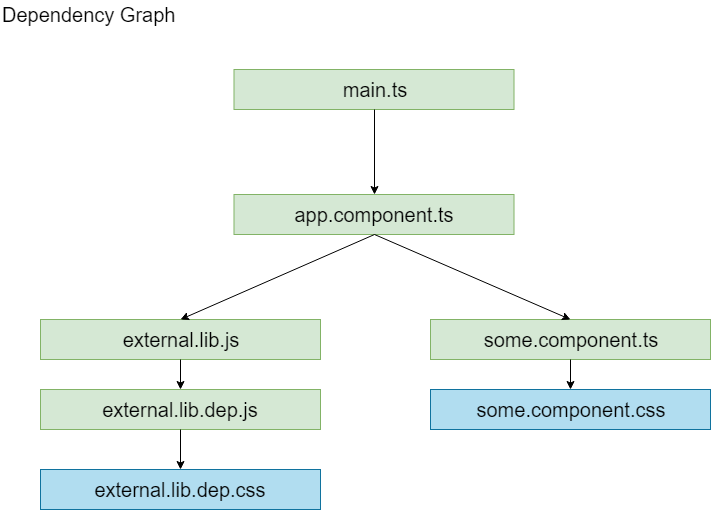

[Back](./README.md)

# Entry

Entry tells the Webpack where the root module or the starting point is. This can be a String, an Array or an Object.
```js
{
  entry: './src/index.js'
}
```
If you want to append multiple files that are **NOT** dependent on each other, you can use the Array format :
```js
// Creates a bundle ot of index.js and appends jquery at it's end.
{
  entry: ['./src/index.js', './src/vendor/jquery.js']
}
```
Now, let’s say you have true multi-page application, not a SPA with multi-views, but with multiple HTML files (**index.html** and **profile.html**). You can then tell Webpack to generate multiple bundles at once by using entry object.

The below config will generate two JS files: **indexEntry.js** and **profileEntry.js** that you can use in **index.html** and **profile.html** respectively.
```js
{
  entry: {
    indexEntry: './src/index.js',
    profileEntry: './src/profile.js'
  }
}
```
Usage in html :
```html
//profile.html
<script src=”dist/profileEntry.js”></script>
//index.html
<script src=”dist/indexEntry.js”></script>
```
entry - combination You can also use the Array type entries inside an entry object. For example the below config will generate 3 files: vendor.js that contains three vendor files, an index.js and a profile.js :
```js
{
  entry: {
    vendor: ['jquery', 'analytics', 'optimizely.js'],
    index: './src/index.js',
    profile: './src/profile.js'
  }
}
```

**Simple rule: one entry point per HTML page. SPA: one entry point, MPA: multiple entry points.**

# Generating a Dependency Graph

The following code :
```js
//webpack.config.js
module.exports = {
  entry: './main.ts',
  //...
}
```
```js
//main.ts
import { Component } from '@angular/core';
import { some } from './some.component';
```
```js
//some.component.ts
@Component({ style: './some.component.css'})
export class App {};
```

Generates :




## Context
The base directory, an absolute path, for resolving entry points and loaders from configuration :
```js
module.exports = {
  //...
  context: path.resolve(__dirname, 'app')
};
```
By default the current directory is used, but it's recommended to pass a value in your configuration. This makes your configuration independent from **CWD** (current working directory).