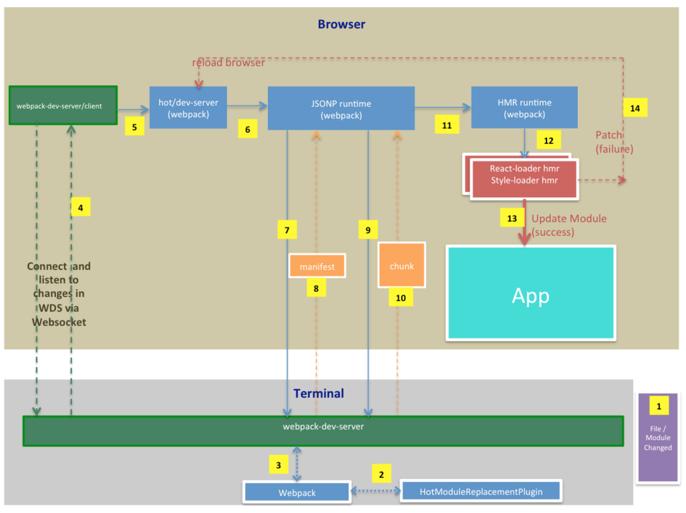

[Back](./README.md)

# Hot Module Replacement(HMR)
HMR can significantly speed up development in a few ways:

1. Retain application state which is lost during a full reload.
2. Save valuable development time by only updating what's changed.
3. Modifications made to CSS/JS in the source code results in an instant browser update which is almost comparable to changing styles directly in the browser's dev tools.

`webpack-dev-server` supports a hot mode in which it tries to update with HMR before trying to reload the whole page.

## How It Works
Webpack injects a whole lot of JS libraries to make HMR work. The below picture shows how various parts work when a file/module change to make it happen :

**Legend :**
* **Green** - `webpack-dev-server` related libs.
* **Blue** - Webpack core and plugin libs.
* **Orange** - chunk manifest or chunk JS file itself.
* **Red** - `react-loader` or `style-loader` HMR libs.
* **Teal** - Your App
* **Purple** - File or module that just changed.A JS or CSS file (module) changes

**Explaining the process step-by-step :**
1. Some File Changed.
2. Webpack uses HotModuleReplacementPlugin to generate a manifest(a JSON containing list of changed modules) and an update file(a JS with the actual change info).
3. Webpack then tells `webpack-dev-server` about the changes.
4. `webpack-dev-server` tells "`webpack-dev-server`/client"(JS file) running in the browser via webSocket by sending "invalid" notification via WebSocket.
5. "`webpack-dev-server`/client" then sends the initial hash that it got when the app was first loaded to hot/dev-server library. "hot/dev-server" acts like the main interface to all other JS files.
6. "hot/dev-server" then calls internal libraries(like JSONP runtime) that are also injected by Webpack to download the manifest file.
7. JSONP runtime uses hash and loads the manifest file from the `webpack-dev-server`.
8. The manifest file contains details about chunks that need to be uploaded to the browser. It's file name looks like: b2e2d54372f42c1b2352.hot-update.json and it's content looks like this: {"h":"b3632c2a800d437e17df","c":[0]}
9. JSONP runtime then uses information contained inside the manifest file to load all the "Update" files/chunks and adds them to the DOM.
10. "Updates JS" themselves are JS files/chunks. They contain information about actual changes that needs to be applied. They are added to the DOM and executed.
11. Updates call HMR runtime with the module id (e.g. moduleId "82" in the above example) and the actual changes.
12. But HMR runtime itself doesn't know how to deal with the changes. So it delegates this job to corresponding loaders like `react-hot-loader` runtimes or `style-loader` runtimes to apply changes. (Note these are also injected into the Browser).
13. If there is no issues with applying the changes, the appropriate runtimes updates the module.
14. If there are issues (like syntax errors in the change), "hot/dev-server" lib is notified about the error.

## In the Application
The following steps allow modules to be swapped in and out of an application:

1. The application asks the HMR runtime to check for updates.
2. The runtime asynchronously downloads the updates and notifies the application.
3. The application then asks the runtime to apply the updates.
4. The runtime synchronously applies the updates.
5. You can set up HMR so that this process happens automatically, or you can choose to require user interaction for updates to occur.

## In the Compiler
In addition to normal assets, the compiler needs to emit an **update** to allow updating from previous version to the new version. The **update** consists of two parts:

1. The updated manifest (JSON)
2. One or more updated chunks (JavaScript)

The manifest contains the new compilation hash and a list of all updated chunks. Each of these chunks contains the new code for all updated modules (or a flag indicating that the module was removed).

The compiler ensures that module IDs and chunk IDs are consistent between these builds. It typically stores these IDs in memory (e.g. with `webpack-dev-server`), but it's also possible to store them in a JSON file.

## In a Module
HMR is an opt-in feature that only affects modules containing HMR code. One example would be patching styling through the `style-loader`. In order for patching to work, the `style-loader` implements the HMR interface; when it receives an update through HMR, it replaces the old styles with the new ones.

Similarly, when implementing the HMR interface in a module, you can describe what should happen when the module is updated. However, in most cases, it's not mandatory to write HMR code in every module. If a module has no HMR handlers, the update bubbles up. This means that a single handler can update a complete module tree. If a single module from the tree is updated, the entire set of dependencies is reloaded.

## In the Runtime
For the module system runtime, additional code is emitted to track module parents and children. On the management side, the runtime supports two methods: check and apply.

A check makes an HTTP request to the update manifest. If this request fails, there is no update available. If it succeeds, the list of updated chunks is compared to the list of currently loaded chunks. For each loaded chunk, the corresponding update chunk is downloaded. All module updates are stored in the runtime. When all update chunks have been downloaded and are ready to be applied, the runtime switches into the ready state.

The apply method flags all updated modules as invalid. For each invalid module, there needs to be an update handler in the module or in its parent(s). Otherwise, the invalid flag bubbles up and invalidates parent(s) as well. Each bubble continues until the app's entry point or a module with an update handler is reached (whichever comes first). If it bubbles up from an entry point, the process fails.

Afterwards, all invalid modules are disposed (via the dispose handler) and unloaded. The current hash is then updated and all accept handlers are called. The runtime switches back to the idle state and everything continues as normal.
