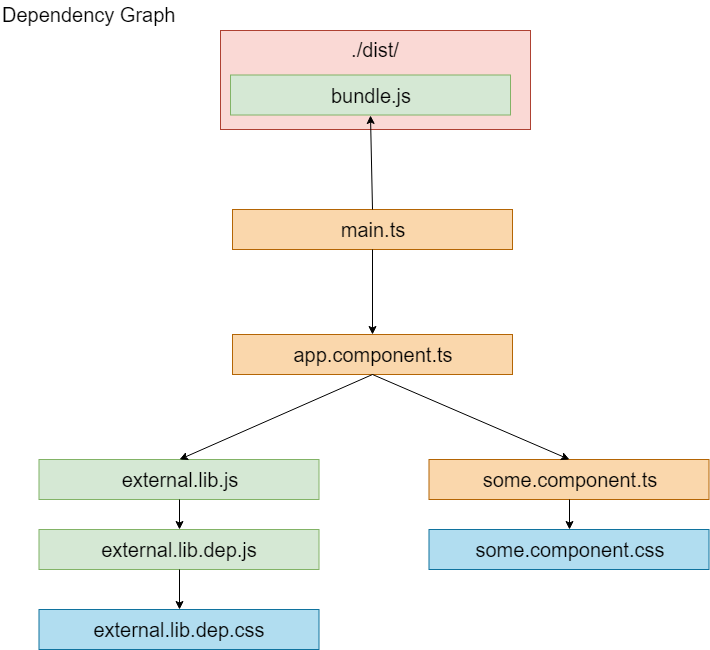

[Back](./README.md)

# Output
Configuring the output configuration options tells webpack how to write the compiled files to disk.

## Usage
The minimum requirements for the output property is to set its value to an object, with a **filename** property :
```js
// This configuration would output a single bundle.js file into the dist directory.
{
  output: {
    filename: 'bundle.js',
  }
};
```

## Multiple Entry Points
If your configuration creates more than a single "chunk" (as with multiple entry points or when using plugins like CommonsChunkPlugin), you should use substitutions to ensure that each file has a unique name :

```js
// writes to disk: ./dist/app.js, ./dist/search.js
{
  entry: {
    app: './src/app.js',
    search: './src/search.js'
  },
  output: {
    filename: '[name].js',
    path: path.resolve(__dirname, 'dist')
  }
}
```

The following substitutions are available in template strings (via webpack's internal **TemplatedPathPlugin**):

| Template    | Description                                                     |
|:-----------:|:---------------------------------------------------------------:|
| [hash]      | The hash of the module identifier                               |
| [chunkhash] | The hash of the chunk content                                   |
| [name]      | The module name                                                 |
| [id]        | The module identifier                                           |
| [query]     | The module query, i.e., the string following ? in the filename  |
| [function]  | The function, which can return filename string                  |

## Example

The following code :
```js
//webpack.config.js
module.exports = {
  entry: './main.ts',
  output: {
    path: './dist',
    filename: './bundle.js',
  },
  //...
}
```
Generates :



## output.publicPath

This option specifies the public URL of the output directory when referenced in a browser. A relative URL is resolved relative to the HTML page (or <base> tag). Server-relative URLs, protocol-relative URLs or absolute URLs are also possible and sometimes required, i. e. when hosting assets on a CDN.

The value of the option is prefixed to every URL created by the runtime or loaders. Because of this the value of this option ends with / in most cases.

Example for **production** :
```js
module.exports = {
  //...
  output: {
    path: path.resolve(__dirname, 'public/assets'),
    publicPath: 'https://cdn.example.com/assets/'
  }
};
```
In **develop** might be :
```js
module.exports = {
  //...
  output: {
    chunkFilename: '[id].chunk.js',
    publicPath: '/assets/'
  }
};
```
A request to a chunk will look like **/assets/4.chunk.js**.
A loader outputting HTML might emit something like this:
```html
<link href="/assets/spinner.gif" />
```
or when loading an image in CSS:
```css
background-image: url(/assets/spinner.gif);
```
Different meanings of publicPath :
```js
module.exports = {
  //...
  output: {
    // One of the below
    publicPath: 'https://cdn.example.com/assets/', // CDN (always HTTPS)
    publicPath: '//cdn.example.com/assets/', // CDN (same protocol)
    publicPath: '/assets/', // server-relative
    publicPath: 'assets/', // relative to HTML page
    publicPath: '../assets/', // relative to HTML page
    publicPath: '', // relative to HTML page (same directory)
  }
};
```

## output.libraryTarget

Supported values :

* **var** - basically IFFEs, which is the default
* **amd** - amd modules
* **umd** - umd modules
* **commonJs** - commonJs modules
* **ES6** - es6 modules